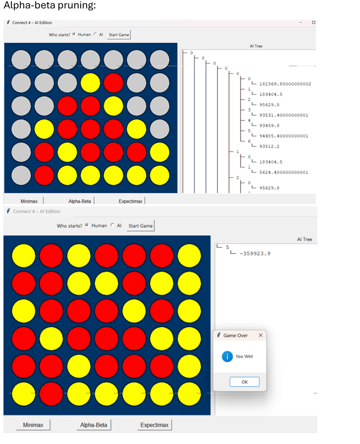

# Connect‑4 AI Game — Adversarial Search Strategies

## Project Overview

This project implements a **Human vs AI Connect‑4 game** to explore classical **adversarial search algorithms** in a practical, interactive setting.

The focus is on:
- Comparing different decision‑making strategies
- Observing how pruning and probabilistic reasoning affect performance
- Visualizing AI decision trees during gameplay

The result is a fully playable GUI‑based game where the user can switch between AI strategies and directly observe their behavior.

---

## Game Description

Connect‑4 is a two‑player game played on a vertical grid (default **7×6**):

- Players take turns dropping discs into columns
- A disc occupies the lowest available cell in that column
- The game continues until the board is full
- The winner is the player with the **greater number of connected fours**
  (horizontal, vertical, or diagonal)

---

## AI Algorithms Implemented

The AI agent supports three different adversarial search strategies:

### Minimax
- Classical adversarial search
- Assumes an optimal opponent
- Explores all branches up to a fixed depth `K`
- Simple but computationally expensive

### Alpha‑Beta Pruning
- Optimized version of Minimax
- Prunes branches that cannot affect the final decision
- Produces the same result as Minimax while expanding far fewer nodes

### Expectimax
- Treats the opponent's moves as **probabilistic**, not fully adversarial
- Evaluates moves using weighted expected values instead of minimums
- Produces more human‑like and less rigid AI behavior

---

## Heuristic Evaluation

Due to the enormous size of the full game tree, all algorithms rely on a **depth‑limited heuristic search**.

The heuristic function evaluates each board state by considering:
- Current scores for AI and Human
- Potential future connections
- Board structure and candidate winning positions

Higher heuristic values favor the AI, while lower values indicate advantage for the human player.

---

## Performance Snapshot

The table below compares node expansion across algorithms at different depth limits:

| Depth (K) | Algorithm     | Nodes Expanded |
|-----------|---------------|----------------|
| 2         | Minimax       | 56             |
|           | Alpha‑Beta    | 56             |
|           | Expectimax    | 140            |
| 3         | Minimax       | 399            |
|           | Alpha‑Beta    | 264            |
|           | Expectimax    | 1,064          |
| 4         | Minimax       | 2,800          |
|           | Alpha‑Beta    | 1,315          |
|           | Expectimax    | 1,166          |
| 5         | Minimax       | 19,667         |
|           | Alpha‑Beta    | **4,707**      |
|           | Expectimax    | 5,779          |

**Key Insight:** Alpha‑Beta pruning significantly reduces node expansion while maintaining optimal decisions compared to plain Minimax.

---

## GUI Features

The project includes a full **Tkinter‑based GUI**:

- Interactive 7×6 Connect‑4 board
- Smooth falling‑piece animations
- Player choice (Human or AI starts)
- Runtime selection of AI algorithm
- Adjustable search depth
- Visual display of the **AI decision tree** after each move

---

## Example Run

**Figure — Sample Alpha‑Beta gameplay** showing board state and the corresponding AI decision tree.



The visualization highlights how pruning reduces unnecessary branches while preserving optimal choices.

---

## Project Structure

```
.
├── connect4.py    # Game logic, heuristic, and AI algorithms
├── gui.py         # Tkinter GUI implementation
├── guitest.py     # Alternative GUI / tree visualization
├── README.md      # Project documentation
└── assets/        # Screenshots and figures
```

---

## How to Run

```bash
python gui.py
```

You can:

- Choose who starts the game
- Select the AI algorithm (Minimax, Alpha‑Beta, Expectimax)
- Set the maximum search depth before the game begins

---

## Notes

- The game uses a depth‑limited search with heuristic evaluation
- Node expansion is used as the primary comparison metric
- Designed for clarity, traceability, and algorithmic understanding

---

> This project was implemented as a collaborative exploration of adversarial search algorithms.

---

##  Author 

**Abdelrhman Anwar**  
  Data Engineer  

📧 **Email:** [abd.ahm.anwar@gmail.com](mailto:abd.ahm.anwar@gmail.com)  
🔗 **LinkedIn:** [www.linkedin.com/in/abdelrhman-anwar](https://www.linkedin.com/in/abdelrhman-anwar)

---

This repository provides a practical comparison of adversarial search techniques through an interactive game environment.
